# Bloomday Architecture

Bloomday is a full-stack event management platform for creating events, sending invitations, managing RSVPs, handling QR-code access, sending reminders, and processing event contributions.

```mermaid
flowchart TD
    %% =========================
    %% USERS
    %% =========================
    Host[Event Host / Admin]
    Guest[Invited Guest]
    Frontend[Frontend Application]

    %% =========================
    %% BACKEND
    %% =========================
    API[Node.js / Express Backend]

    Auth[Authentication System]
    Event[Event Management]
    Invite[Invitation System]
    QR[QR Code System]
    Payment[Contribution Payment System]
    Cron[Background Cron Jobs]
    Email[Email Notification Service]

    %% =========================
    %% EXTERNAL SERVICES
    %% =========================
    DB[(MongoDB Database)]
    Cloudinary[(Cloudinary Media Storage)]
    Paystack[(Payment Gateway)]
    SMTP[(Nodemailer / SMTP)]

    %% =========================
    %% EVENT CREATION FLOW
    %% =========================
    Host -->|Signup / Login| Frontend
    Frontend -->|Auth Request| API
    API --> Auth
    Auth --> DB

    Host -->|Create Event| Frontend
    Frontend -->|Create Event API| API
    API --> Event
    Event -->|Generate Unique Slug| Event
    Event -->|Generate QR Code| QR
    QR -->|Upload QR Image| Cloudinary
    Event -->|Upload Invitation Image IV| Cloudinary
    Event -->|Save Event Details| DB

    %% =========================
    %% INVITATION FLOW
    %% =========================
    Host -->|Send Invites| Frontend
    Frontend -->|Send Invite Request| API
    API --> Invite
    Invite -->|Generate Unique Invite Token| Invite
    Invite -->|Save Invite With Expiry Date| DB
    Invite -->|Send Invite Email| Email
    Email --> SMTP
    SMTP -->|Email Delivered| Guest

    %% =========================
    %% GUEST INTERACTION FLOW
    %% =========================
    Guest -->|Clicks Invite Link| Frontend
    Guest -->|Scans QR Code| Frontend
    Frontend -->|View Invite By Token| API
    API --> Invite
    Invite -->|Validate Token| DB
    Invite -->|Return Event + Invite Status| Frontend

    Guest -->|Accepts / Declines Invite| Frontend
    Frontend -->|Accept / Decline API| API
    API --> Invite
    Invite -->|Update RSVP Status| DB

    %% =========================
    %% REMINDER + EXPIRATION FLOW
    %% =========================
    Cron -->|Find Invites Expiring Tomorrow| DB
    Cron -->|Send Reminder Emails Before Event / Expiry| Email

    Cron -->|Find Expired Invites| DB
    Cron -->|Mark Expired Invites As Revoked| DB

    %% =========================
    %% PAYMENT / CONTRIBUTION FLOW
    %% =========================
    Guest -->|Makes Contribution| Frontend
    Frontend -->|Initialize Payment| API
    API --> Payment
    Payment --> Paystack
    Paystack -->|Payment Verification / Webhook| Payment
    Payment -->|Save Contribution Record| DB
    Payment -->|Send Contribution Receipt| Email

    %% =========================
    %% MEDIA FLOW
    %% =========================
    Cloudinary -->|Returns Secure Image URLs| Event
    Event --> DB
```

## Key System Features

- Full-stack event management system
- Secure user authentication
- Event creation with unique slugs
- QR code generation for event access
- Dynamic invitation image handling through Cloudinary
- Token-based invite system
- Accept / decline RSVP flow
- Invite expiry and revocation logic
- Automated reminder emails before expiry/event day
- Contribution payment system
- Payment verification and receipt emails
- MongoDB persistence
- Background cron jobs for automation